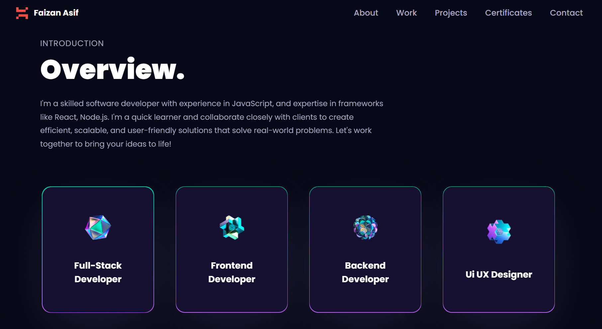
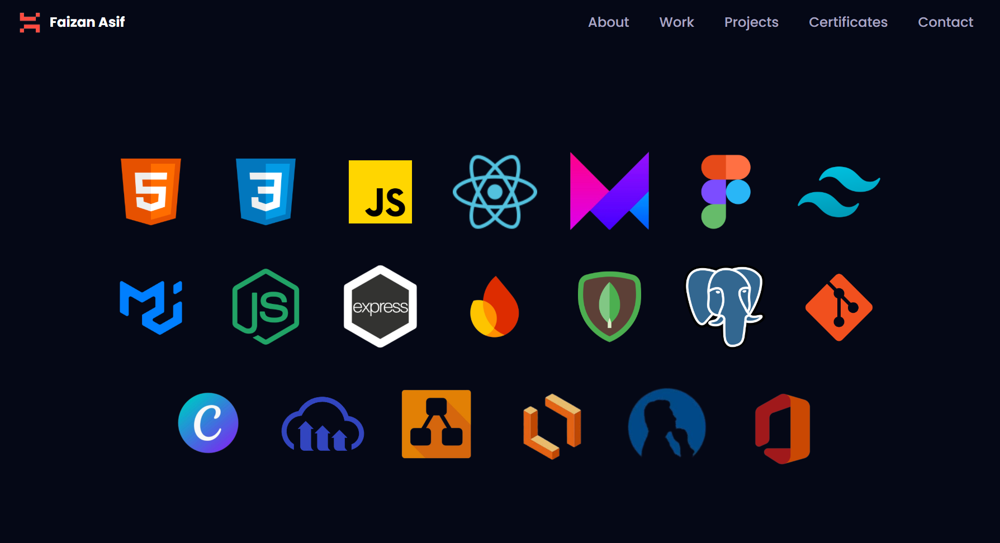
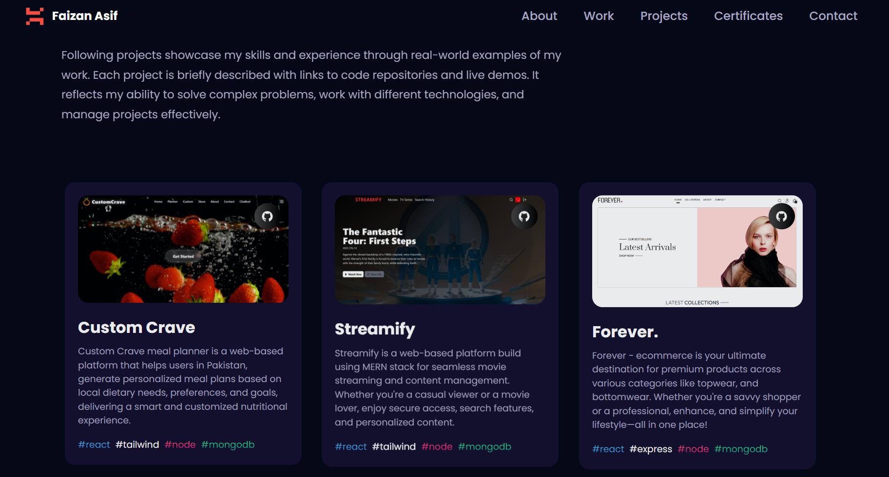

<a name="top"></a>
<h1 align="center">My Portfolio build with MERN Stack🎬</h1>


## This is how my portfolio looks like:

<table>
  <tr>
    <td>
      <a href='./intro.png'></a>
    </td>
    <td>
      <a href='./techntools.png'></a>
    </td>
    <td>
      <a href='./projects.png'></a>
    </td>
  </tr>
</table>

## About This Project:


⚛️ Tech Stack: <kbd>[React.js](https://react.dev/learn/installation)</kbd>, <kbd>[Node.js](https://nodejs.org/en/download/package-manager)</kbd>, <kbd>[Express.js](https://expressjs.com)</kbd>, <kbd>[MongoDB](https://www.mongodb.com)</kbd>, <kbd>[Tailwind CSS](https://tailwindcss.com/docs/installation)</kbd>

### 🔧 Backend 
- 🗄️ MongoDB Setup with Atlas
- 📧 Contact Form Submission Handling
- 🔒 CORS Configuration for Frontend Integration
- 🌍 Environment Variable Management
- 📝 Contact/Feedback Data Storage
- 🔐 Secure API Endpoints
- 🚀 Production-Ready Configuration
  
### 🌐 Frontend
- 🎨 Modern 3D Animations.
- 📱 Responsive Design with Tailwind CSS
- 🎯 Interactive Project Showcase
- 📧 Contact Form with Toast Notifications
- 🏆 Certificates Section with Accordion Layout
- 🌟 Smooth Scroll Navigation
- 🎭 Framer Motion Animations
- 📋 Professional Portfolio Sections
- 🚀 Vite Build System
- 💫 GSAP Animations
- 🎪 3D Canvas Components
- 🌐 Production Deployment Ready

<br/>

## System requirements

> [!NOTE]
> Before you start, make sure you have the following installed:
- [x] Node.js 18.0.0 or later installed.
- [x] React.js 18.0.0 or later.
- [x] MongoDB Atlas account for database.
- [x] Operating systems: macOS, Windows, or Linux.
- [x] VSCode or another text editor of your choice.

<br/>

## Code organization and folder structure


```

(Root)
├───backend               
│     ├───config
│     │    └───DBconnection.js
│     ├───controllers
│     │    └───contactController.js
│     ├───models
│     │    └───contactModel.js
│     ├───routes
│     │    └───contactRoutes.js
│     ├───bin
│     │    └───www
│     ├───(app.js)
│     ├───(package.json)
│     └───(package.lock.json)
│
├───frontend               
│     ├───public
│     │    ├───desktop_pc
│     │    └───planet
│     ├───src  
│     │     ├───components
│     │     │     ├───canvas
│     │     │     ├───About.jsx
│     │     │     ├───Contact.jsx
│     │     │     ├───Certificates.jsx
│     │     │     ├───Experience.jsx
│     │     │     ├───Feedbacks.jsx
│     │     │     ├───Hero.jsx
│     │     │     ├───Navbar.jsx
│     │     │     ├───Tech.jsx
│     │     │     └───Works.jsx
│     │     ├───constants
│     │     │    └───index.js
│     │     ├───hoc
│     │     │    └───SectionWrapper.jsx
│     │     ├───utils
│     │     │    └───motion.js
│     │     ├───assets
│     │     │    ├───certificates
│     │     │    ├───company
│     │     │    └───tech
│     │     ├───(App.jsx)
│     │     ├───(main.jsx)
│     │     └───(index.css)
│     │
│     ├───(index.html)
│     ├───(tailwind.config.js)
│     ├───(vite.config.js)
│     ├───(package.json)
│     └───(package.lock.json)
│             
├───(README.md)
└───(LICENSE)

```

###  `public` **directory**

This folder serves static assets, including 3D models (desktop_pc, planet) and other public files.

###  `components` **directory**

This folder contains React components for different sections of the portfolio including About, Contact, Certificates, Experience, Hero, Navbar, Tech, and Works components.

###  `constants` **directory**

This folder contains configuration data like navigation links, project information, technologies, and other constants used throughout the application.

### `hoc` **directory**

This folder contains Higher-Order Components (HOC) like SectionWrapper that provide common functionality to multiple components.

###  `utils` **directory**

This folder contains utility functions and animations, including motion configurations for Framer Motion.

### `assets` **directory**

This folder contains all static assets including images, certificates, company logos, and technology icons used throughout the portfolio.

### `index.css` **file**

This is the main CSS file of the application with Tailwind CSS imports and custom styles.


<br/>

## 🚀 Quick Start Guide

To spin up this project locally, follow these steps

### Clone

Use the ` git clone ` CLI to clone template directly  to your machine


### Run project on local

```bash
npm run build
npm start
```

## Project Dev Steps

1. Environment Setup
   
   Create a `.env` file on the root of project
   PUT THIS INSIDE

```bash

# Backend Configuration
PORT=3000
NODE_ENV=development

# Database Configuration
MONGODB_URI=your_mongodb_atlas_connection_string

# Frontend URLs for CORS
LOCAL_FRONTEND_URL=http://localhost:5173
PRODUCTION_FRONTEND_URL=https://your-frontend-url.onrender.com

# Frontend API URLs
VITE_API_URL_LOCAL=http://localhost:3000/api
VITE_API_URL_PRODUCTION=https://your-backend-url.onrender.com/api

```

2.  Project Folders & Files Structure

3.  Update `package.json` file from root directory

```json

// For mac and linux users
 "scripts": {
    "dev": "NODE_ENV=development&& concurrently \"cd backend && npm run dev\" \"cd frontend && npm run dev\" ",
    "start": "NODE_ENV=production&& node backend/bin/www",
    "build": "npm install && npm install --prefix backend && npm install --prefix frontend && npm run build --prefix frontend",
    "format": "prettier --print-width=120 --write ."
  }

// For windows users
 "scripts": {
    "dev": "SET NODE_ENV=development&& concurrently \"cd backend && npm run dev\" \"cd frontend && npm run dev\" ",
    "start": "SET NODE_ENV=production&& node backend/bin/www",
    "build": "npm install && npm install --prefix backend && npm install --prefix frontend && npm run build --prefix frontend",
    "format": "prettier --print-width=120 --write ."
  }

```
4.  Setup Eslint & Prettier
   
5.  Run project in development

```bash

npm install
npm run dev

```

> [!TIP]
> Run this command to format code before running `git commit` command.

```bash
npm run format
```

### I'll see you in the next one!

<br>

[Back to top](#top)
